# 知识地图(updating)

<!--  -->

- [产品领域（0-1）](product/readme.md)
- [运营营销领域（1-100）](operation/README.md)
- [技术领域](program/README.md)

---

- [模板](template/README.md)
- [工具](tool/README.md)
- [方法](methodology/README.md)

---

- [经济金融](economy/README.md)
- [团队管理](team/README.md)
