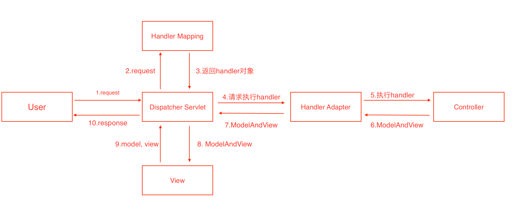

# spring 系列

<!-- @import "[TOC]" {cmd="toc" depthFrom=1 depthTo=6 orderedList=false} -->

## bean 的生命周期

1. 实例化 Bean
2. 设置对象属性（依赖注入）
3. 注入 Aware 接口
4. BeanPostProcessor
5. InitializingBean 与 init-method
6. 正常使用
7. DisposableBean 和 destroy-method

### spring 提供的 bean 生命周期过程中的扩展点

- InitializingBean：在执行完 BeanPostProcessor 的 postProcessBeforeInitialization 方法后，如果这个 bean 实现了 InitializingBean 接口，则会去调用 afterPropertiesSet 方法。
- 各种 Aware：在在执行完 BeanPostProcessor 的 postProcessBeforeInitialization 方法前，如果 bean 实现了 BeanNameAware 或 BeanClassLoaderAware 或 BeanFactoryAware，则会调用接口相关的方法，入参就是这个 bean 关心的值。
- BeanPostProcessor：针对所有 bean,会传入 bean 对象

## BeanFactory 和 ApplicationContext 接口区别

1. BeanFactory 是 Spring 最底层接口，包含了各种 Bean 的定义，读取 bean 配置文档，管理 bean 的加载、实例化、控制 bean 的生命周期，维护 bean 之间依赖关系。ApplicationContext 是 BeanFactory 的派生接口，除了提供 BeanFactory 所具有的功能外，还提供了更完整的框架功能
2. BeanFactory 采用的是延迟加载来注入 Bean，只有 getBean 时才会进行实例化
3. BeanFactory 通常以编程的方式被创建，ApplicationContext 还能以生命的方式创建
4. 都支持 BeanPostProcessor,BeanFactoryPostProcessor

## IOC

### DefaultListableBeanFactory

## AOP

Spring 中 AOP 代理使用 JDK 动态代理和 CGLIB 代理来实现，默认如果目标对象是接口，则使用 JDK 动态代理，否则使用 CGLIB 来生成代理类。

## springmvc 的五大组件

- DispatcherServlet：请求的入口
- HandlerMapping： 请求的派发 负责让请求 和 控制器建立一一对应的关联
- Controller：真正的处理器
- ModelAndView：封装模型信息和视图信息的
- ViewResolver：视图处理器 最终定位页面的

## spring mvc 流程

1. 客户端发送请求，携带 url 地址；
2. 前端控制器 Dispatcher Servlet 接收到请求，调用处理器映射 Handler Mapping 找到对应的处理器，生成并返回 handler 对象；
3. 前端控制器 Dispatcher Servlet 调用处理器适配器 Handler Adapter；
4. Handler Adapter 经过适配，调用相应的适配器执行 handler 对象斌返回结果给 Handler Adapter，再返回给前端控制器 Dispatcher Servlet，结果包括数据结构和视图对象；
5. 前端控制器 Dispatcher Servlet 调用视图解析器 View Resolver 将携带的数据结构和视图对象进行解析，解析完成后响应给 Dispatcher Servlet；
6. 核心控制器将结果返回给客户端。

## mybatis 原理

### #{}和\${}的区别是什么

1. #{}是预编译处理，\${}是字符串替换
2. MyBatis 在处理#{}时会将 sql 中的#{}替换为?号，调用 PreparedStatement 的 set 方法来复制
3. MyBatis 在处理${}时，就是把${}替换为变量的值
4. 使用#{}可以防止 sql 注入

## spirng @Transactional 事务的传播
