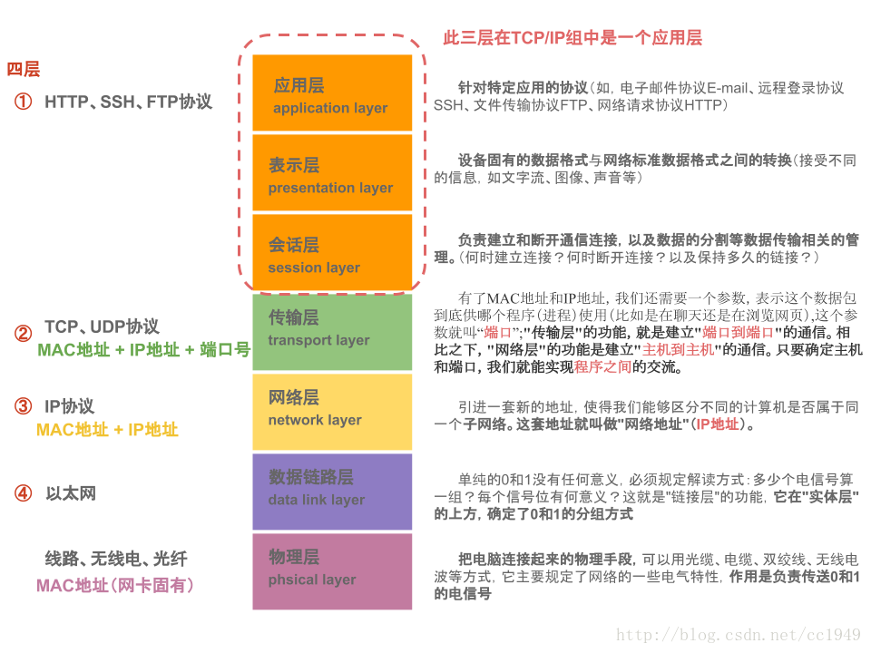
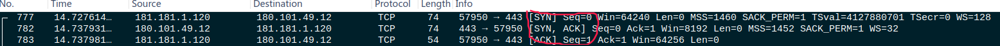
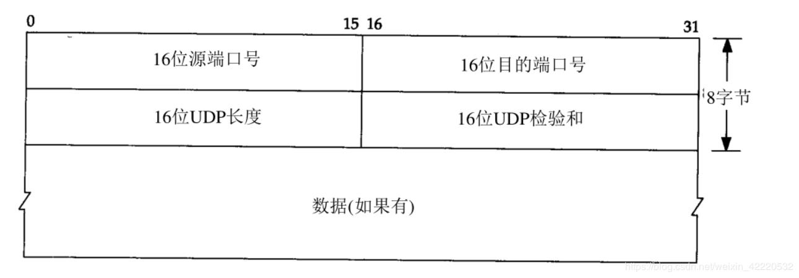

# 网络：协议

<!-- @import "[TOC]" {cmd="toc" depthFrom=1 depthTo=6 orderedList=false} -->

<!-- code_chunk_output -->

- [网络:协议](#网络协议)
  - [OSI 参考模型及常见协议](#osi-参考模型及常见协议)
  - [OSI 和 TCP/IP](#osi-和-tcpip)
  - [物理层](#物理层)
  - [数据链路层](#数据链路层)
    - [二层交换机工作流程](#二层交换机工作流程)
    - [二层交换机和路由器的区别](#二层交换机和路由器的区别)
  - [网络层](#网络层)
    - [三层交换机工作流程](#三层交换机工作流程)
    - [二层交换机、三层交换机、路由器的应用场景](#二层交换机-三层交换机-路由器的应用场景)
  - [传输层](#传输层)
    - [TCP 消息头](#tcp-消息头)
    - [TCP 的建立](#tcp-的建立)
    - [TCP 连接断开](#tcp-连接断开)
    - [TCP 的重传](#tcp-的重传)
    - [TCP 慢启动与流控](#tcp-慢启动与流控)
    - [TCP 粘包、拆包及解决办法](#tcp-粘包-拆包及解决办法)
    - [UDP](#udp)
      - [UDP 消息头](#udp-消息头)
  - [应用层](#应用层)
    - [DNS](#dns)
    - [FTP](#ftp)
    - [HTTP/HTTPS](#httphttps)

<!-- /code_chunk_output -->

## OSI 参考模型及常见协议

## OSI 和 TCP/IP

  
  
  

## 物理层

## 数据链路层

### 二层交换机工作流程

第二层交换技术是工作在 OSI 七层网络模型中的第二层，即数据链路层

1. 当交换机从某个端口收到一个数据包，它先读取包头中的源 MAC 地址，这样它就知道源 MAC 地址的机器是连在哪个端口上的；
2. 再去读取包头中的目的 MAC 地址，并在地址表中查找相应的端口；
3. 如表中有与这目的 MAC 地址对应的端口，把数据包直接复制到这端口上；
4. 如表中找不到相应的端口则把数据包广播到所有端口上，当目的机器对源机器回应时，交换机又可以学习一目的 MAC 地址与哪个端口对应，在下次传送数据时就不再需要对所有端口进行广播了。

不断的循环这个过程，对于全网的 MAC 地址信息都可以学习到，二层交换机就是这样建立和维护它自己的地址表。

### 二层交换机和路由器的区别

- 二层交换机属于 OSI 第二层即数据链路层设备。它根据 MAC 地址寻址，通过站表选择路由，站表的建立和维护由交换机自动进行。
- 路由器属于 OSI 第三层即网络层设备，它根据 IP 地址进行寻址，通过路由表路由协议产生。

## 网络层

### 三层交换机工作流程

三层交换机通过**硬件**执行数据包交换。三层交换机在对第一个数据包送控制面进行路由查找后，它将会产生一个供数据面查找的 MAC 地址与 IP 地址的映射表，当同样的数据流再次通过时，将根据此表查表通过而不是再次送控制面查路由（即“一次路由，多次交换”）

### 二层交换机、三层交换机、路由器的应用场景

- 二层交换机用于小型的局域网络。在小型局域网中，广播包影响不大，二层交换机的快速交换功能、多个接入端口和低谦价格为小型网络用户提供了很完善的解决方案。
- 三层交换机的最重要的功能是加快大型局域网络内部的数据的快速转发，加入路由功能也是为这个目的服务的。如果把大型网络按照部门，地域等等因素划分成一个个小局域网，这将导致大量的网际互访，单纯的使用二层交换机不能实现网际互访；如单纯的使用路由器，由于接口数量有限和路由转发速度慢，将限制网络的速度和网络规模，采用具有路由功能的快速转发的三层交换机就成为首选。
- 路由器的功能更多的体现在不同类型网络之间的互联上，如局域网与广域网之间的连接、不同协议的网络之间的连接等，优势在于选择最佳路由、负荷分担、链路备份及和其他网络进行路由信息的交换等。另外，为了与各种类型的网络连接，路由器的接口类型非常丰富，而三层交换机则一般仅同类型的局域网接口，非常简单

## 传输层

### TCP 消息头

### TCP 的建立

> **思考 1： tcp 握手握的是啥？**
> 通信双方数据原点的序列号
>
> ---
>
> **思考 2： tcp 为什么是 3 次握手，而不是 2 次，或者 4 次握手？**
> A <-------> B
> 四次握手的过程：
>
> 1. A 发送同步信号 SYN + A's Initial sequence number
> 2. B 确认收到 A 的同步信号，并记录 A's ISN 到本地，命名 B's ACK sequence number
> 3. B 发送同步信号 SYN + B's Initial sequence number
> 4. A 确认收到 B 的同步信号并记录 B's ISN 到本地，命名 A's ACK sequence number
>
> 很显然 2 和 3 这两个步骤可以合并，只需要三次握手，可以提高连接的速度与效率。
> 

### TCP 连接断开

> **思考 1：tcp 断开连接为什么是 4 次挥手，而不是 3 次？**
>
> 1. 建立连接的时候， 服务器在 LISTEN 状态下，收到建立连接请求的 SYN 报文后，把 ACK 和 SYN 放在一个报文里发送给客户端。
> 2. 而关闭连接时，主机收到 FIN 设置为 1 的 TCP 段之后不必马上回复一个 FIN 包，而是可以等到缓冲区中的所有数据都因为已成功发送而被自动删除之后再发 FIN 包，己方 ACK 和 FIN 一般都会分开发送，从而导致多了一次。
>
> ---
>
> **思考 2： 服务器上大量的 TIME_WAIT 时是什么原因？**
>
> TIME_WAIT 出现在主动关闭的一方， 当对端发送了 FIN 后，经过 2MSL（max segment lifetime）时间之后，才会彻底关闭回收资源。为什么要这么做？明明就已经主动关闭连接了为啥还要保持资源一段时间呢？这个是 TCP/IP 的设计者规定 的，主要出于以下两个方面的考虑：
>
> - 防止上一次连接中的包，迷路后重新出现，影响新连接（经过 2MSL，上一次连接中所有的重复包都会消失）
> - 可靠的关闭 TCP 连接。在主动关闭方发送的最后一个 ack(fin) ，有可能丢失，这时被动方会重新发 fin, 如果这时主动方处于 CLOSED 状态 ，就会响应 rst 而不是 ack。所以主动方要处于 TIME_WAIT 状态，而不能是 CLOSED
>
> ---
>
> **思考 3：服务器上大量的 CLOSE_WAIT 是什么原因？**
>
> CLOSE_WAIT 出现在被动关闭的一方，没有发送第二次 FIN，没有 close 这个连接

### TCP 的重传

在发送一个数据之后，就开启一个定时器，若是在这个时间内没有收到发送数据的 ACK 确认报文，则对该报文进行重传，在达到一定次数还没有成功时放弃并发送一个复位 RST 信号。

### TCP 慢启动与流控

### TCP 粘包、拆包及解决办法

- 消息定长：发送端将每个数据包封装为固定长度（不够的可以通过补 0 填充），这样接收端每次接收缓冲区中读取固定长度的数据就自然而然的把每个数据包拆分开来。
- 设置消息边界：服务端从网络流中按消息边界分离出消息内容。在包尾增加回车换行符进行分割，例如 FTP 协议。
- 将消息分为消息头和消息体：消息头中包含表示消息总长度（或者消息体长度）的字段。

### UDP

#### UDP 消息头

## 应用层

### DNS

### FTP

### HTTP/HTTPS

> 问题：HTTPS 为什么要同时使用非对称加密和对称加密？
>
> - 非对称加密用于协商对称加密的密钥，密钥是协商出来的，不是固定的
> - 对称加密用于加密应用的数据
