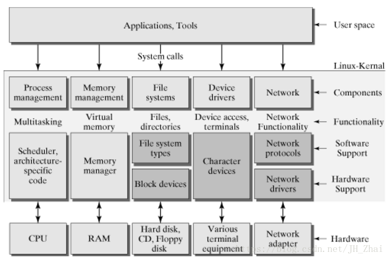

# linux

## Linux 内核

### 进程管理及调度

#### 进程的生命周期

> 拓展：linux 进程调度和 golang 协程调度之间的对比?

### 进程间通信

操作系统管理了很多进程，多个进程间存在需要相互通信的需求

- 管道( pipe )：
- 信号量( semophore ) ：
- 消息队列( message queue ) ：
- 信号 ( sinal ) ：
- 共享内存( shared memory ) ：
- 套接字( socket ) ：

### 内存管理

### 驱动

### VFS 文件系统

### 网络

## 内核态和用户态

## Linux 常用命令

### 命令参数规律
