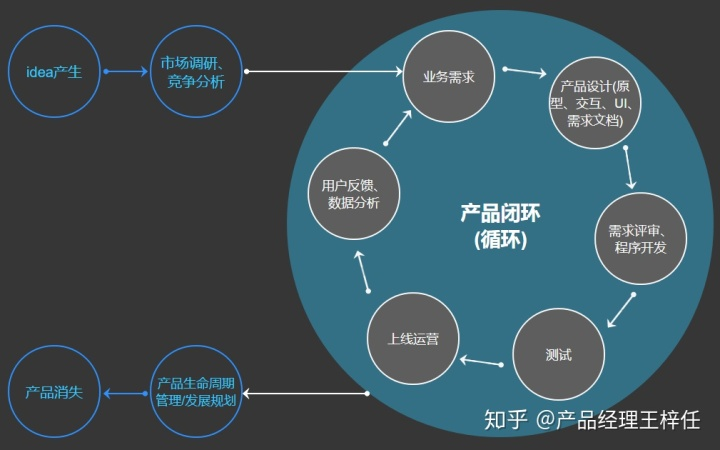
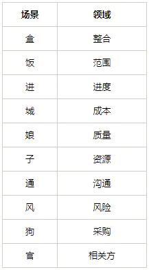
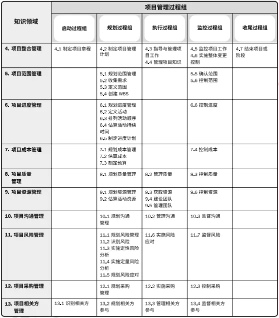

<!-- @import "[TOC]" {cmd="toc" depthFrom=1 depthTo=6 orderedList=false} -->

<!-- code_chunk_output -->

- [1. IT 产品生命周期](#1-it-产品生命周期)
- [2. PMP 的五大过程组，十大知识领域，49 个过程，每个过程的输入、工具和输出](#2-pmp-的五大过程组十大知识领域49-个过程每个过程的输入-工具和输出)
- [3. 项目管理者的职责](#3-项目管理者的职责)
- [4. 方法论](#4-方法论)
- [5. PMP 工具图](#5-pmp-工具图)
  - [5.1. 甘特图](#51-甘特图)
  - [5.2. 鱼骨图](#52-鱼骨图)

<!-- /code_chunk_output -->

## 1. IT 产品生命周期

## 2. PMP 的五大过程组，十大知识领域，49 个过程，每个过程的输入、工具和输出

盒饭进城，娘子通风狗官

## 3. 项目管理者的职责

## 4. 方法论

见方法论篇

## 5. PMP 工具图

### 5.1. 甘特图

### 5.2. 鱼骨图
