# 开发技术篇

## 硬件

---

[X86](hardware/x86.md)  
[ARM](hardware/arm.md)

## 操作系统

---

[linux](os/linux.md)  
[网络：协议](os/network/protocol.md)  
[网络：实现](os/network/implement.md)

<!-- [RT-Thread](os/rtthread.md) -->

## 语言 & 开发工具

---

[编译原理](language/c++/compile.md)  
[语言的共性](language/lang.md)

[assembly(x64)](language/asm/asm.md)  
[c/c++](language/c++/cpp.md)  
[java](language/java/java.md), [jdk 并发包](language/java/juc.md), [jvm 虚拟机](language/java/jvm.md)  
[go](language/go/golang.md)  
[shell](language/shell/shell.md)  
[python](language/python/python.md)

<!-- [javascript](language/javascript.md) -->

[gdb](devtool/gdb.md)  
[gun binutils](devtool/binutils.md)

## 数据结构 & 容器

---

[常用数据结构](datastructure/data_structure.md)  
[常用容器](datastructure/container.md)

## 算法

---

[常用算法](algorithm/algorithm.md)

## 设计 & 架构

---

[设计模式](architecture/designmod.md)  
[领域驱动设计 DDD](architecture/ddd.md)  
[C4 架构设计](architecture/c4_model.md)

[分布式](architecture/distribute.md)  
[高并发](architecture/high_concurency.md)  
[高可用](architecture/high_available.md)  
[微服务](architecture/microservice.md)  
[Service Mesh](architecture/service_mesh.md)

## 常用框架

---

[spring-boot](framework/springboot.md)  
[brpc](framework/brpc.md)  
[dubbo](framework/dubbo.md)

## 常用中间件

---

| 领域分类       | 链接                                         | 应用场景                               |
| :------------- | :------------------------------------------- | -------------------------------------- |
| web 服务器     | [nginx](middleware/nginx.md)                 | web 服务器，反向代理                   |
| 消息队列       | [kafka](middleware/kafka.md), pulsar         | 消息削峰，分布式最终一致性消息队列方案 |
| 调试分析       | [arthas](middleware/arthas.md)               | 生产环境调试，类似 gdb                 |
| 数据库         | [mysql](middleware/mysql.md)                 | 关系型数据存储                         |
| 缓存           | [redis](middleware/redis.md)                 | 缓存数据提高性能，分布式锁等           |
| 搜索           | [elasticsearch](middleware/elasticsearch.md) | 全文检索                               |
| 流媒体         | [ffmpeg](middleware/ffmpeg.md)               | 视频播放                               |
| 分布式事务     | [Seata](middleware/seata.md)                 | 分布式事务管理，支持多种模式           |
| 流式计算       | flink                                        | 流式计算                               |
| 时序数据库     | [influx](middleware/influx.md)               | trace 采集，监控运维 ，带时间性的数据  |
| nosql          | [mongodb](middleware/mongo.md)               | 非关系型数据库                         |
| 安全           | openRASP                                     | 无侵入式 java 应用程序安全性           |
| 向量检索       | [milvus](middleware/milvus.md)               | 非结构化数据提取向量，再进行向量检索   |
| 图数据库       | neo4j                                        | 关系链                                 |
| 微服务链路追踪 | skywalking                                   | 链路追踪                               |
| 微服务限流     | sentinel                                     | 微服务稳定性，限流，降级，防止服务雪崩 |

## 工程化

---

[CI/CD](engineering/cicd.md)  
[docker](middleware/docker.md)  
[k8s](middleware/k8s.md)
