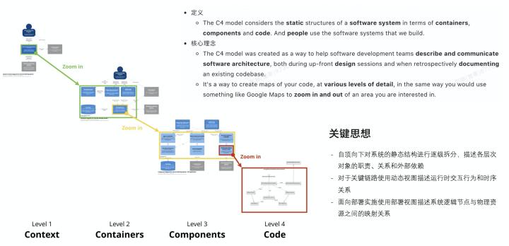
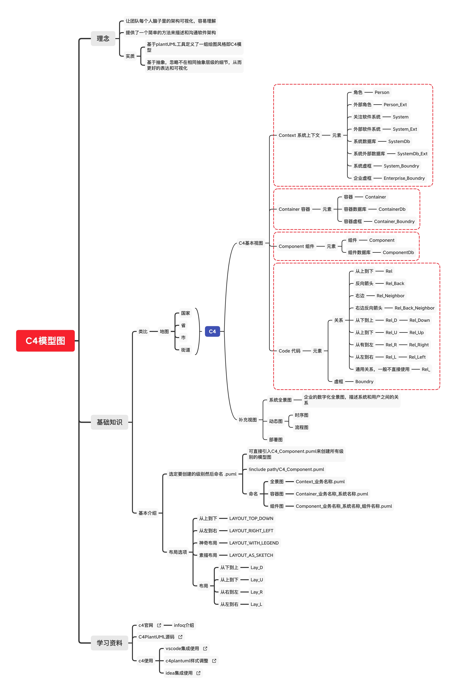

<!-- @import "[TOC]" {cmd="toc" depthFrom=1 depthTo=6 orderedList=false} -->

<!-- code_chunk_output -->

- [什么是 C4-Model？](#什么是-c4-model)
  - [人（Person）](#人person)
  - [软件系统（Software System）](#软件系统software-system)
  - [容器（Container）](#容器container)
  - [组件（Component）](#组件component)
- [C4 图的几个元素](#c4-图的几个元素)
- [C4 的几张核心图](#c4-的几张核心图)
  - [Level1：语境图(System Context Diagram)](#level1语境图system-context-diagram)
  - [Level2：容器图(Container Diagram)](#level2容器图container-diagram)
  - [Level3：组件图(Component Diagram)](#level3组件图component-diagram)
  - [Level4：类图(Code/Class Diagram)](#level4类图codeclass-diagram)
  - [补充图：Landscape / Dynamic / Deployment Diagram](#补充图landscape-dynamic-deployment-diagram)
- [总结](#总结)
- [参考文档](#参考文档)

<!-- /code_chunk_output -->

## 1. 什么是 C4-Model？

架构图要明确面向人群，根据面向人群的不同，产出四幅图来描述一个系统或者一个架构。

System Context --> Container --> Component --> Code 四个层次。

在 C4 模型中软件系统被抽象为几个部分：

- （人）Person
- （软件系统）Software System
- （容器）Container
- （组件）Component
- （代码）Code

**当我们看待真实世界的“架构图”时候，是要不停的缩放，在每一个层次刻意忽略一些细节才能表达好当前抽象层次的信息。** 类似下面的地图一样，不同层级需要关注的点是不一样的。

### 1.1. 人（Person）

这一抽象的提前是软件系统中“人”的部分与”物“分离，例如角色，或者外部子系统等。

### 1.2. 软件系统（Software System）

软件系统是最高级别的抽象，它描述了一些可以为用户带来价值的东西，无论他们是不是“人”。这包括您正在建模的软件系统，以及该软件系统所依赖的其他软件系统。

### 1.3. 容器（Container）

容器代表托管代码或数据的事物。为了使整个软件系统正常工作，必须运行一个容器。实际上，容器类似于服务器端的应用程序、一个手机 APP，又或者是一个数据库。

### 1.4. 组件（Component）

“组件”一词在软件开发行业中是一个非常重载的术语，但是在这种情况下，组件只是封装在定义良好的接口后面的一组相关功能。如果您使用的是 Java 或 C＃之类的语言，则想到组件的最简单方法是它是接口后面的实现类的集合。这些组件的打包方式（例如，每个 JAR 文件，DLL，共享库中的一个组件与许多组件）的打包方式是一个单独且相互关注的问题。

Note：容器内的所有组件通常都在同一处理空间中执行。

## 2. C4 图的几个元素

- 关系——带箭头的线
- 元素——方块和角色
- 关系描述——线上的文字
- 元素的描述——方块和角色里的文字
- 元素的标记——方块和角色的颜色、虚线框

## 3. C4 的几张核心图

### 3.1. Level1：语境图(System Context Diagram)

在这一层级中细节并不重要，只需要显示系统概况。 重点应该放在人员（角色）和软件系统上，而不是技术，协议和其他低层级细节上，从而使非技术人员也能够看得懂。这个图也是明确需求的重要图示。

作用：

- 构建的系统是什么
- 谁会用它
- 如何融入已有的 IT 环境

### 3.2. Level2：容器图(Container Diagram)

本质上，容器是可单独运行/可部署的单元（例如，单独的进程空间） ）执行代码或存储数据。容器图显示了软件体系结构的高层结构以及如何在其间分配职责。 它还显示了主要的技术选择以及容器之间的通信方式。

作用：

- 展现了软件系统的整体形态
- 体现了高层次的技术决策
- 系统中的职责是如何分布的，容器间的是如何交互的
- 告诉开发者在哪里写代码

### 3.3. Level3：组件图(Component Diagram)

组件图显示了容器如何由多个“组件”组成，每个组件是什么，它们的职责以及技术/实现接口（API）或者细节。

作用：

- 描述了系统由哪些组件/服务组成
- 厘清了组件之间的关系和依赖
- 为软件开发如何分解交付提供了框架

### 3.4. Level4：类图(Code/Class Diagram)

### 3.5. 补充图：Landscape / Dynamic / Deployment Diagram

## 4. 总结

## 5. 参考文档

- [可视化架构设计——C4 介绍](https://www.jianshu.com/p/33c6a7ed126f)
- [如何画出一张合格的技术架构图？](https://zhuanlan.zhihu.com/p/62172175)
- [架构制图：工具与方法论](https://zhuanlan.zhihu.com/p/260068315?utm_source=wechat_session&utm_medium=social&utm_oi=29809690279936&utm_campaign=shareopn)
