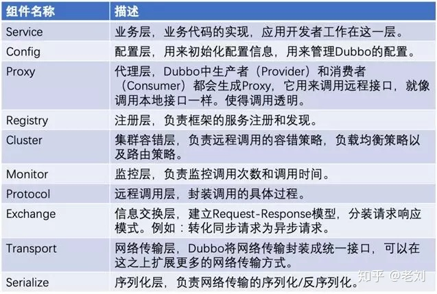

<!-- @import "[TOC]" {cmd="toc" depthFrom=1 depthTo=6 orderedList=false} -->

<!-- code_chunk_output -->

- [1. 整体架构](#1-整体架构)
- [2. 启动过程](#2-启动过程)
- [3. 消费者](#3-消费者)
- [4. 生产者](#4-生产者)
  - [4.1. 服务是如何发布的](#41-服务是如何发布的)
- [5. 重要的 SPI 扩展点](#5-重要的-spi-扩展点)
  - [5.2. Invoker](#52-invoker)
  - [5.4. ProxyFactory](#54-proxyfactory)
  - [5.3. Cluster](#53-cluster)
  - [5.1. Protocol](#51-protocol)

<!-- /code_chunk_output -->

## 1. 整体架构

## 2. 启动过程

## 3. 消费者

## 4. 生产者

### 4.1. 服务是如何发布的

## 5. 重要的 SPI 扩展点

### 5.1. Invoker

### 5.2. ProxyFactory

### 5.3. Cluster

### 5.4. Protocol
