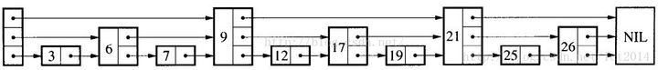

<!-- @import "[TOC]" {cmd="toc" depthFrom=1 depthTo=6 orderedList=false} -->

<!-- code_chunk_output -->

- [1. redis 和 memcached 的区别？](#1-redis-和-memcached-的区别)
- [2. redis 的数据类型](#2-redis-的数据类型)
- [3. redis 数据类型底层存储实现](#3-redis-数据类型底层存储实现)
- [4. redis 存储结构 ziplist](#4-redis-存储结构-ziplist)
- [5. redis 存储结构 skiplist](#5-redis-存储结构-skiplist)
- [6. redis 高性能的原因](#6-redis-高性能的原因)
- [7. Redis 如何做持久化](#7-redis-如何做持久化)
- [8. Redis 集群模式](#8-redis-集群模式)
- [9. redis 集群模式的 一致性 hash 算法](#9-redis-集群模式的-一致性-hash-算法)
- [10. Redis 如何做异步队列？](#10-redis-如何做异步队列)
- [11. redis 如何实现延时队列?](#11-redis-如何实现延时队列)
- [12. 缓存穿透是什么?](#12-缓存穿透是什么)
- [13. 缓存击穿是什么？](#13-缓存击穿是什么)
- [14. 缓存雪崩是什么？](#14-缓存雪崩是什么)
- [15. LRU（Least Recently Used：最近最少使用）是什么](#15-lruleast-recently-used最近最少使用是什么)
- [16. LRU 的实现方法](#16-lru-的实现方法)
- [17. redis 内存淘汰机制](#17-redis-内存淘汰机制)
- [18. redis 集群模式添加/删除节点重新分配 slot](#18-redis-集群模式添加删除节点重新分配-slot)
- [19. redis 事务](#19-redis-事务)
- [20. 如何保证缓存和数据库的双写一致性？](#20-如何保证缓存和数据库的双写一致性)
- [21. redis lua](#21-redis-lua)
- [22. redis 客户端 jedis 和 redisson 有哪些区别？](#22-redis-客户端-jedis-和-redisson-有哪些区别)
- [23. redis 选择 hash 还是 string 存储数据？](#23-redis-选择-hash-还是-string-存储数据)
- [24. 如何用 redis 存储 1 亿的用户状态？](#24-如何用-redis-存储-1-亿的用户状态)

<!-- /code_chunk_output -->

## 1. redis 和 memcached 的区别？

- redis 支持的类型更多
- redis 可以持久化

## 2. redis 的数据类型

1. 字符串类型（String) 常规的 get/set 操作，value 可以是 String 也可以是数字，一般做一些复杂的记数功能缓存
2. 列表类型(List) 可以存列表数据，可以做简单的消息队列
3. 哈希类型(Hash) 这里 value 存放的是结构化对象，类似于 map
4. 集合类型(Set) 存放的是一堆不重复的集合
5. 有序集合(ZSet) 多了一个权重 score，集合中的元素能够按 score 进行排列

## 3. redis 数据类型底层存储实现

| 类型       | 编码       | 对象               |
| :--------- | :--------- | :----------------- |
| String     | int        | 整数值实现         |
| String     | embstr     | sds 实现 <=39 字节 |
| String     | raw        | sds 实现 > 39 字节 |
| List       | ziplist    | 压缩列表实现       |
| List       | linkedlist | 双端链表实现       |
| Set        | intset     | 整数集合使用       |
| Set        | hashtable  | 字典实现           |
| Hash       | ziplist    | 压缩列表实现       |
| Hash       | hashtable  | 字典使用           |
| Sorted set | ziplist    | 压缩列表实现       |
| Sorted set | skiplist   | 跳跃表和字典       |

## 4. redis 存储结构 ziplist

- ziplist 是为节省内存空间而生的。
- ziplist 是一个为 Redis 专门提供的底层数据结构之一，本身可以有序也可以无序。当作为 list 和 hash 的底层实现时，节点之间没有顺序；当作为 zset 的底层实现时，节点之间会按照大小顺序排列。

## 5. redis 存储结构 skiplist

skiplist
其实跳表就是在普通单向链表的基础上增加了一些索引，而且这些索引是分层的，从而可以快速地查的到数据。

Skiplist 本质上是一种链表， 但是我们知道链表的查询是比较慢的，时间复杂度为 O(n)， 为了提升查询的效率， 需要额外的存储一些信息， 使得它可以避免从头到尾一个一个遍历， 常用的做法是有序二叉树的二分查找， 可以做到时间复杂度为 O(log(n))， 但是平衡二叉树的实现通常比较复杂，尤其是有添加删除的时候， 二叉树的平衡性可能被破坏， 需要旋转。
Skiplist 的效率虽然没有平衡二叉树高， 但是它实现起来简单， 并且插入删除操作不需要更多复杂的操作。



## 6. redis 高性能的原因

1. 基于内存
2. 单线程
3. 多路复用 IO

## 7. Redis 如何做持久化

1. RDB（Redis database 内存快照）持久化：保存某个时间点的全量数据快照，分为手动触发和自动触发。
   优点：全量数据快照，文件小，恢复快，
   缺点：最近一次数据可能会丢失，数据量大有瓶颈。

2. AOF（Append Only File 日志文件）持久化：记录每次对服务器写的操作，当服务器重启的时候会重新执行。
   优点：可读性高，适合保存增量数据，不易丢失，
   缺点：但是文件体积大，恢复时间长

RDB 更适合并发高数据量小的场景
AOF 适合并发小数据量大的场景

RDB 是全量存储，AOF 是增量存储。

## 8. Redis 集群模式

1. 主从复制 主节点写，从节点读。不具备容错和恢复能力，因为是单点读写
2. 哨兵模式 启动独立进程，检测主从节点随时切换，可多哨兵相互监控
3. 集群模式 实现了缓存的分布式存储，使用 Hash 槽

## 9. redis 集群模式的 一致性 hash 算法

使用 hash 槽方式，和 hash 环类似。

## 10. Redis 如何做异步队列？

1. List 结构 rpush 生产消息，lpop(非阻塞)或者 bpop(阻塞)消费，但是不支持 1:N 消费
2. Pub/Sub 支持 1:N 消费，如果担心数据丢失使用 MQ

## 11. redis 如何实现延时队列?

Zset 可以设置 score，score 设置为当前时间+延时时长。然后通过 zrangeWithScores 来查询，取到数据后，用 zrem 删除。不过，由于 zrangeWithScores 和 zrem 是两个不同的步骤，多线程时可能会被打断。所以，可以用 lua 脚步来代替，在 redis 中，lua 脚步是原子性的。

```java
String luaScript = "local resultArray = redis.call('zrangebyscore', KEYS[1], 0, ARGV[1], 'limit' , 0, 1)\n" +
        "if #resultArray > 0 then\n" +
        "    if redis.call('zrem', KEYS[1], resultArray[1]) > 0 then\n" +
        "        return resultArray[1]\n" +
        "    else\n" +
        "        return ''\n" +
        "    end\n" +
        "else\n" +
        "    return ''\n" +
        "end";

jedis.eval(luaScript, ScriptOutputType.VALUE, new String[]{key}, String.valueOf(System.currentTimeMillis()));
```

## 12. 缓存穿透是什么?

key 对应的数据在数据源并不存在，每次针对此 key 的请求从缓存获取不到，请求都会到数据源，从而可能压垮数据源。

解决方案：

1. 布隆过滤器；
2. 缓存和数据都没数据的可以设置缓存为 null，缓存时间设置的短一点。

## 13. 缓存击穿是什么？

key 对应的数据存在，但在 redis 中过期，此时若有大量并发请求过来，这些请求发现缓存过期一般都会从后端 DB 加载数据并回设到缓存，这个时候大并发的请求可能会瞬间把后端 DB 压垮。

解决方案：

1. 设置热点数据永不过期
2. 添加互斥锁，setnx，简单地来说，就是在缓存失效的时候（判断拿出来的值为空），不是立即去 load db，而是先使用缓存工具的某些带成功操作返回值的操作（比如 Redis 的 SETNX 或者 Memcache 的 ADD）去 set 一个 mutex key，当操作返回成功时，再进行 load db 的操作并回设缓存；否则，就重试整个 get 缓存的方法。

## 14. 缓存雪崩是什么？

大批量缓存同一时间到期，而查询数据量巨大，引起数据库压力过大。

解决方案：

1. 缓存数据的过期时间设置随机；

## 15. LRU（Least Recently Used：最近最少使用）是什么

是一种常用的页面置换算法，选择最近最久未使用的页面予以淘汰。该算法赋予每个页面一个访问字段，用来记录一个页面自上次被访问以来所经历的时间 t，当须淘汰一个页面时，选择现有页面中其 t 值最大的，即最近最少使用的页面予以淘汰。

## 16. LRU 的实现方法

map + 双向链表

map 中存数据，双向链表保存访问顺序。put 和 get 的时候，把节点放到双向链表的头部。当超过容量的时候，从尾部删除，尾部的数据是最少使用到的。

## 17. redis 内存淘汰机制

- volatile-lru：从已设置过期时间的数据集（server.db[i].expires）中挑选最近最少使用的数据淘汰
- volatile-ttl：从已设置过期时间的数据集（server.db[i].expires）中挑选将要过期的数据淘汰
- volatile-random：从已设置过期时间的数据集（server.db[i].expires）中任意选择数据淘汰
- allkeys-lru：从数据集（server.db[i].dict）中挑选最近最少使用的数据淘汰
- allkeys-random：从数据集（server.db[i].dict）中任意选择数据淘汰
- no-enviction（驱逐）：禁止驱逐数据

volatile 和 allkeys 规定了是对已设置过期时间的数据集淘汰数据还是从全部数据集淘汰数据，后面的 lru、ttl 以及 random 是三种不同的淘汰策略，再加上一种 no-enviction 永不回收的策略。

## 18. redis 集群模式添加/删除节点重新分配 slot

## 19. redis 事务

## 20. 如何保证缓存和数据库的双写一致性？

【疑问一】更新 cache 还是淘汰 cache？

1. 复杂点的缓存场景，缓存不单单是数据库中直接取出来的值。
2.

【疑问二】执行顺序的问题：先更新缓存还是先更新数据库？

1. 先更新数据库，再删除缓存的策略中，因为要删除缓存，但如果缓存删除失败，就会导致数据库与缓存不一致

【疑问三】高并发情况下，如果同时有读和写，先删除缓存后，在写 db 前，读操作又从 db 加载数据到缓存，还是会导致脏数据，解决办法：延时双删除，但是还是可能出现第二次删除失败的情况

```java
redis.delete();
db.update();
Thread.sleep(1000);  //为了避免sleep影响兵法，可以把第二步删除放到异步线程池中去
redis.delete();
```

## 21. redis lua

redis lua 会保证 lua 脚步执行的原子性，可以用来实现 CAS

## 22. redis 客户端 jedis 和 redisson 有哪些区别？

Jedis 和 Redisson 都是 Java 中对 Redis 操作的封装。Jedis 只是简单的封装了 Redis 的 API 库，可以看作是 Redis 客户端，它的方法和 Redis 的命令很类似。Redisson 不仅封装了 redis ，还封装了对更多数据结构的支持，以及锁等功能，相比于 Jedis 更加大。但 Jedis 相比于 Redisson 更原生一些，更灵活。

## 23. redis 选择 hash 还是 string 存储数据？

hash 更省内存

## 24. 如何用 redis 存储 1 亿的用户状态？

用 redis 的 bitmap 数据类型来存储，用了 bit 表示一个用户的状态
