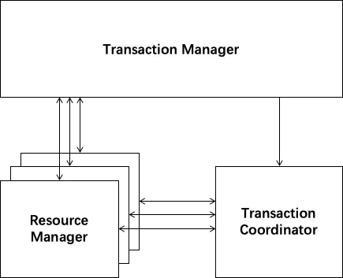

<!-- @import "[TOC]" {cmd="toc" depthFrom=1 depthTo=6 orderedList=false} -->

<!-- code_chunk_output -->

- [1. seata 介绍](#1-seata-介绍)
- [2. seata 整体划分](#2-seata-整体划分)
- [3. seata 工作流程](#3-seata-工作流程)
- [4. seata 的模式](#4-seata-的模式)
  - [4.1. AT 模式](#41-at-模式)
    - [4.1.1. AT 模式的优点和缺点](#411-at-模式的优点和缺点)
  - [4.2. TCC 模式](#42-tcc-模式)
    - [4.2.1. TCC 模式优缺点](#421-tcc-模式优缺点)
    - [4.2.2. TCC 模式注意点](#422-tcc-模式注意点)
  - [4.3. Sage](#43-sage)
  - [4.4. XA 模式](#44-xa-模式)
- [5. 模式选择](#5-模式选择)

<!-- /code_chunk_output -->

## 1. seata 介绍

http://seata.io/zh-cn/docs/overview/what-is-seata.html

Seata 是一款开源的分布式事务解决方案，致力于提供高性能和简单易用的分布式事务服务。Seata 将为用户提供了 AT、TCC、SAGA 和 XA 事务模式，为用户打造一站式的分布式解决方案。

## 2. seata 整体划分

- TM(Transaction Manager)：全局事务管理器，控制全局事务边界，负责全局事务开启、全局提交、全局回滚。
- RM(Resource Manager)：资源管理器，控制分支事务，负责分支注册、状态汇报，并接收事务协调器的指令，驱动分支（本地）事务的提交和回滚。
- TC(Transaction Coordinator)：事务协调器，维护全局事务的运行状态，负责协调并驱动全局事务的提交或回滚。

## 3. seata 工作流程

AT 模式的工作流程分为两阶段。一阶段进行业务 SQL 执行，并通过 SQL 拦截、SQL 改写等过程生成修改数据前后的快照（Image），并作为 UndoLog 和业务修改在同一个本地事务中提交。

如果一阶段成功那么二阶段仅仅异步删除刚刚插入的 UndoLog；如果二阶段失败则通过 UndoLog 生成反向 SQL 语句回滚一阶段的数据修改。其中关键的 SQL 解析和拼接工作借助了 Druid Parser 中的代码

## 4. seata 的模式

### 4.1. AT 模式

在 AT 模式下，用户只需关心自己的 “业务 SQL”。分为两阶段

一阶段：执行用户 SQL
二阶段：Seata 框架自动生成

在一阶段，Seata 会拦截“业务 SQL”，首先解析 SQL 语义，找到“业务 SQL”要更新的业务数据，在业务数据被更新前，将其保存成“before image”，然后执行“业务 SQL”更新业务数据，在业务数据更新之后，再将其保存成“after image”，最后生成行锁。以上操作全部在一个数据库事务内完成，这样保证了一阶段操作的原子性。

二阶段如果是提交的话，因为“业务 SQL”在一阶段已经提交至数据库， 所以 Seata 框架只需将一阶段保存的快照数据和行锁删掉，完成数据清理即可。

二阶段如果是回滚的话，Seata 就需要回滚一阶段已经执行的“业务 SQL”，还原业务数据。回滚方式便是用“before image”还原业务数据；但在还原前要首先要校验脏写，对比“数据库当前业务数据”和 “after image”，如果两份数据完全一致就说明没有脏写，可以还原业务数据，如果不一致就说明有脏写，出现脏写就需要转人工处理。

#### 4.1.1. AT 模式的优点和缺点

AT 模式的一阶段、二阶段提交和回滚均由 Seata 框架自动生成，用户只需编写“业务 SQL”，便能轻松接入分布式事务，AT 模式是一种对业务无任何侵入的分布式事务解决方案。

### 4.2. TCC 模式

TCC 分为三个阶段：

Try：做业务检查和资源预留
Confirm：确认提交
Cancel：业务执行错误需要回滚的状态下执行分支事务的业务取消，预留资源释放

#### 4.2.1. TCC 模式优缺点

相对于 AT 模式，TCC 模式对业务代码有一定的侵入性，但是 TCC 模式无 AT 模式的全局行锁，TCC 性能会比 AT 模式高很多。

#### 4.2.2. TCC 模式注意点

1. 允许空回滚： try 丢包，收到了 cancel，cancel 需要返回成功
2. 防悬挂控制： cancel 先于 try 收到，try 需要先检查事务有没有回滚过，有回滚就不执行 try
3. 幂等处理：Try、Confirm、Cancel 三个方法均要保证幂等性。

### 4.3. Sage

### 4.4. XA 模式

## 5. 模式选择

AT 模式是无侵入的分布式事务解决方案，适用于不希望对业务进行改造的场景，几乎 0 学习成本。

TCC 模式是高性能分布式事务解决方案，适用于核心系统等对性能有很高要求的场景。
